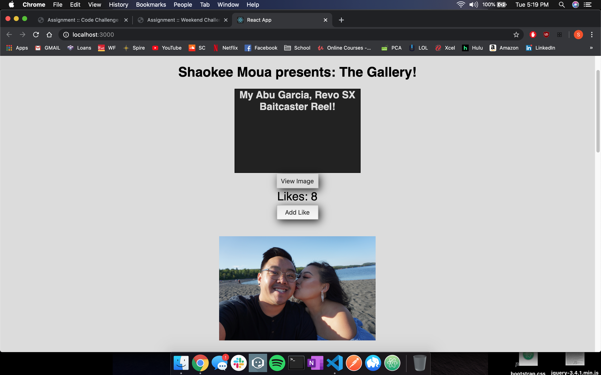
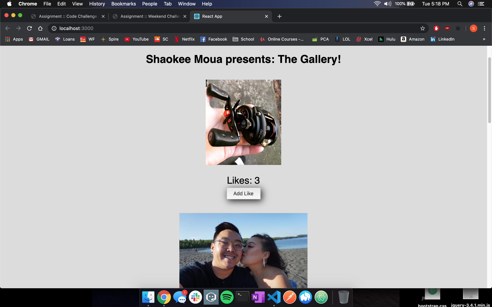

# GALLERY OF SHAOKEE MOUA

## Description

In this project we had to create a Gallery of photos, and when those photos are clicked they should show their description. Also we must add a like button that increments the amount of likes by 1 every time we click it. To do this we had to make sure our server and client was running. My first step was to make sure that server was working with our GET request, then using axios, which is similar to ajax for jQuery. Understanding "this" and "state" were crucial to send our data down to the child components. I decided to get the images to display on the DOM first, creating a new component called GalleryList and using props to receive data from the App.js component. Afterwards knowing I would have to click on each individual image, I created the GalleryItem which handles my click event for the description and displaying my images. The last part was getting my add like function to work properly by calling it through props into a function in App.js. This was challenging because we just learned React, but with the skills we've acquired from jQuery and Databases, I know I could solve this challenge.

## SCREEN SHOTS





## Prerequisites

Software required to install this application are as listed:

* Node.js

## INSTALLATION

1.) Open source code editor and run ```npm install```

2.) Run ```npm start``` in your terminal

3.) Open ```http://localhost:5000``` in your browser

## BUILT WITH
* Javascript
* React
* React-Redux
* HTML
* CSS

## ACKNOWLEDGEMENT
Thank you to Prime Digital Academy and my cohort Lamport!
